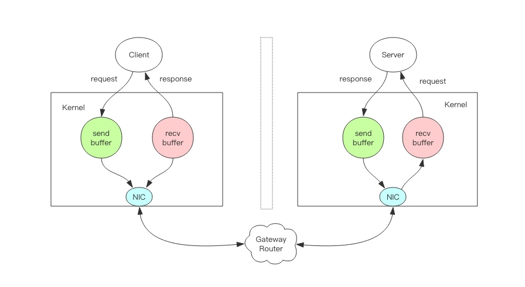

## RPC

### RPC 需要避免的问题

1. **对象构造得过于复杂：**

   > 属性很多，并且存在多层的嵌套，比如 A 对象关联 B 对象，B 对象又聚合 C 对象，C 对象又关联聚合很多其他对象，对象依赖关系过于复杂。序列化框架在序列化与反序列化对象时，对象越复杂就越浪费性能，消耗 CPU，这会严重影响 RPC 框架整体的性能；另外，对象越复杂，在序列化与反序列化的过程中，出现问题的概率就越高。

2. **对象过于庞大**

   > 入参对象非常大，比如为一个大 List 或者大 Map，序列化之后字节长度达到了上兆字节。这种情况同样会严重地浪费了性能、CPU，并且序列化一个如此大的对象是很耗费时间的，这肯定会直接影响到请求的耗时。

3. **使用序列化框架不支持的类作为入参类**

   > 比如 Hessian 框架，他天然是不支持 LinkHashMap、LinkedHashSet 等，而且大多数情况下最好不要使用第三方集合类，如 Guava 中的集合类，很多开源的序列化框架都是优先支持编程语言原生的对象。因此如果入参是集合类，应尽量选用原生的、最为常用的集合类，如 java 的 HashMap、ArrayList。

4. **对象有复杂的继承关系**

   > 大多数序列化框架在序列化对象时都会将对象的属性一一进行序列化，当有继承关系时，会不停地寻找父类，遍历属性。就像问题 1 一样，对象关系越复杂，就越浪费性能，同时又很容易出现序列化上的问题。

### RPC消息协议设计

本部分内容参考自 [RPC消息协议设计](http://byteliu.com/2018/06/11/RPC消息协议设计/)

#### RPC 通讯简单图示

#### RPC 协议组成

对于一串消息流，我们必须能确定消息边界，提取出单条消息的字节流片段，然后对这个片段按照一定的规则进行反序列化来生成相应的消息对象。

消息表示指的是序列化后的消息字节流在直观上的表现形式，它看起来是对人类友好还是对计算机友好。文本形式对人类友好，二进制形式对计算机友好。

每个消息都有其内部字段结构，结构构成了消息内部的逻辑规则，程序要按照结构规则来决定字段序列化的顺序。

* 消息边界：

  > RPC需要在一条TCP链接上进行多次消息传递。在连续的两条消息之间必须有明确的分割规则，以便接收端可以将消息分割开来，这里的接收端可以是RPC服务器接收请求，也可以是RPC客户端接收响应。

  > 基于TCP链接之上的单条消息如果过大，就会被网络协议栈拆分为多个数据包进行传送。如果消息过小，网络协议栈可能会将多个消息组合成一个数据包进行发送。对于接收端来说它看到的只是一串串的字节数组，如果没有明确的消息边界规则，接收端是无从知道这一串字节数组究竟是包含多条消息还是只是某条消息的一部分。

  * **特殊分割符法**

    > 消息发送端在每条消息的末尾追加一个特殊的分割符，并且保证消息中间的数据不能包含特殊分割符。比如最为常见的分割符是`\r\n`。当接收端遍历字节数组时发现了`\r\n`，就可以断定`\r\n`之前的字节数组是一条完整的消息，可以传递到上层逻辑继续进行处理。HTTP和Redis协议就大量使用了`\r\n`分割符。此种消息一般要求消息体的内容是文本消息。
    
    
    
  * **长度前缀法**
  
    > 消息发送端在每条消息的开头增加一个4字节长度的整数值，标记消息体的长度。这样消息接受者首先读取到长度信息，然后再读取相应长度的字节数组就可以将一个完整的消息分离出来。此种消息比较常用于二进制消息。
  
    
    
  * **两者区别**
  
    * 基于特殊分割符法的优点在于消息的可读性比较强，可以直接看到消息的文本内容，缺点是不适合传递二进制消息，因为二进制的字节数组里面很容易就冒出连续的两个字节内容正好就是分割符的ascii值。如果需要传递的话，一般是对二进制进行base64编码转变成普通文本消息再进行传送。
    * 基于长度前缀法的优点和缺点同特殊分割符法正好是相反的。长度前缀法因为适用于二进制协议，所以可读性很差。但是对传递的内容本身没有特殊限制，文本和内容皆可以传输，不需要进行特殊处理。HTTP 协议的Content-Length头信息用来标记消息体的长度，这个也可以看成是长度前缀法的一种应用。
  
* 消息压缩

  * 如果消息的内容太大，就要考虑对消息进行压缩处理，这可以减轻网络带宽压力。但是这同时也会加重 CPU的负担，因为压缩算法是CPU计算密集型操作，会导致操作系统的负载加重。所以，最终是否进行消息压缩，一定要根据业务情况加以权衡，不要为了压缩占用大量系统资源，导致正常系统服务出现问题。
  * 如果确定压缩，那么在选择压缩算法包时，务必挑选那些底层用C语言实现的算法库

* 流量的优化

  * 使用变长整数varint来表示整数

    > 对于一个整形数字，一般使用4个字节来表示一个整数值。但消息传递中大部分使用的整数值都是很小的非负整数，如果全部使用4个字节来表示一个整数会很浪费。所以就发明了一个类型叫变长整数varint。数值非常小时，只需要使用一个字节来存储，数值稍微大一点可以使用2个字节，再大一点就是3个字节，它还可以超过4个字节用来表达长整形数字。
    >
    > 其原理就是保留每个字节的最高位的bit来标识是否后面还有字节，1表示还有字节需要继续读，0表示到读到当前字节就结束。

    

  * 使用zigzag编码来表示负数

    > zigzag编码将整数范围一一映射到自然数范围，然后再进行varint编码
    >
    > zigzag将负数编码成正奇数，正数编码成偶数。解码的时候遇到偶数直接除 2 就是原值，遇到奇数就加1除以2再取负就是原值。

    

    