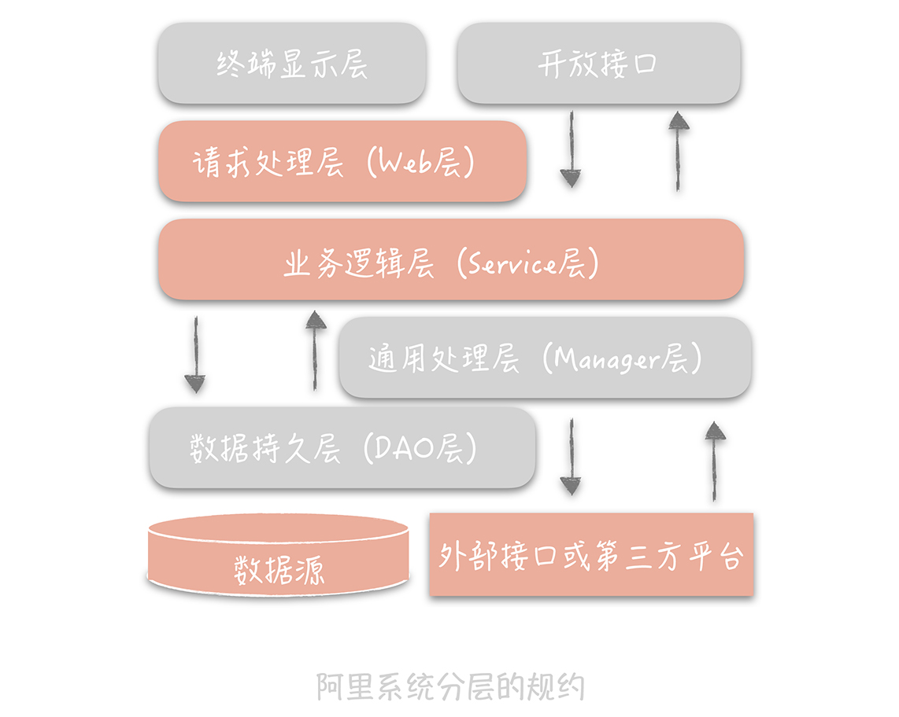
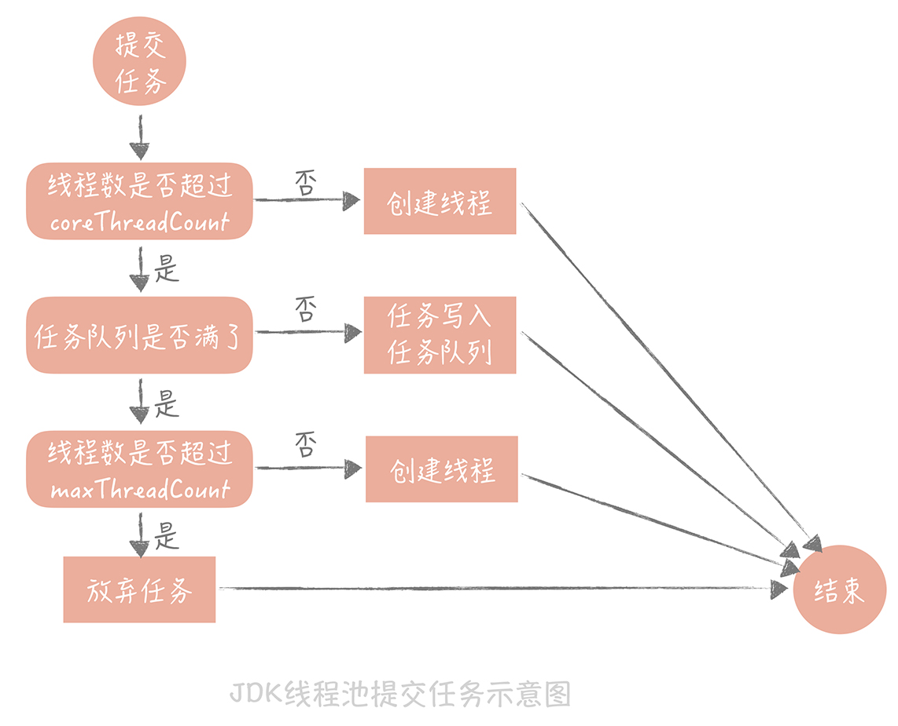
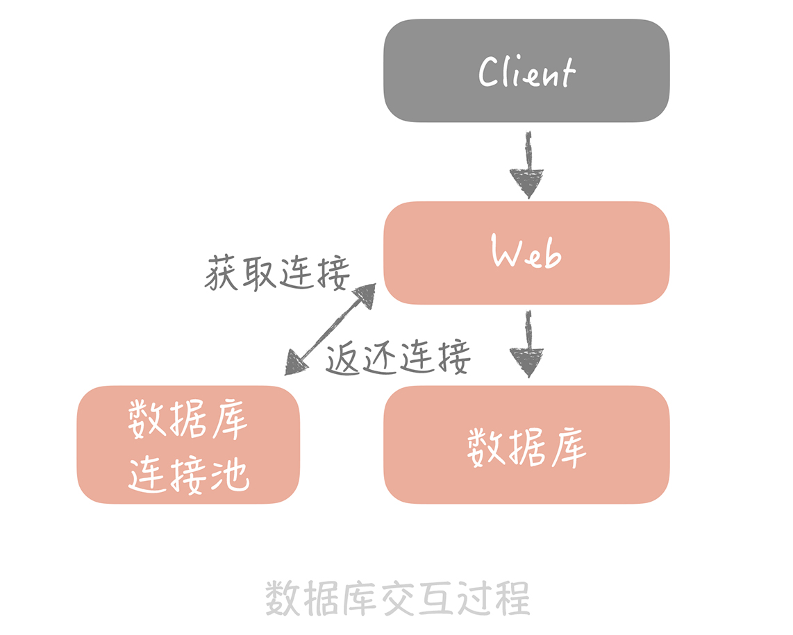
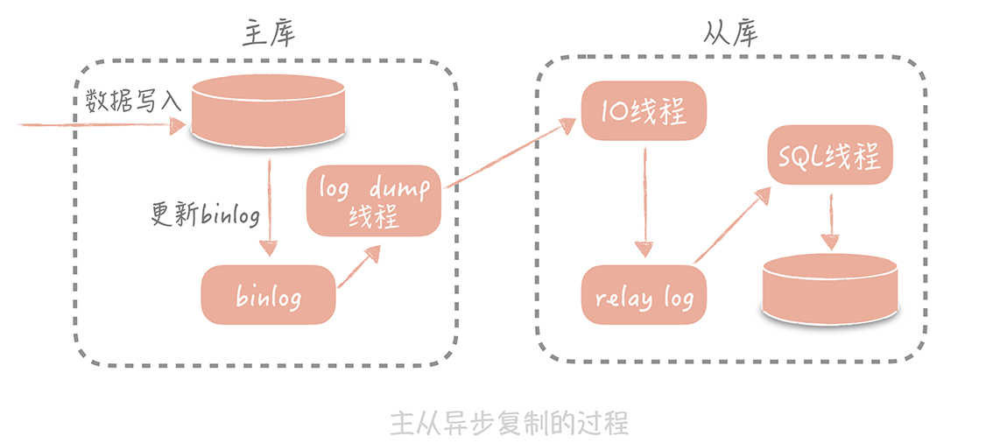
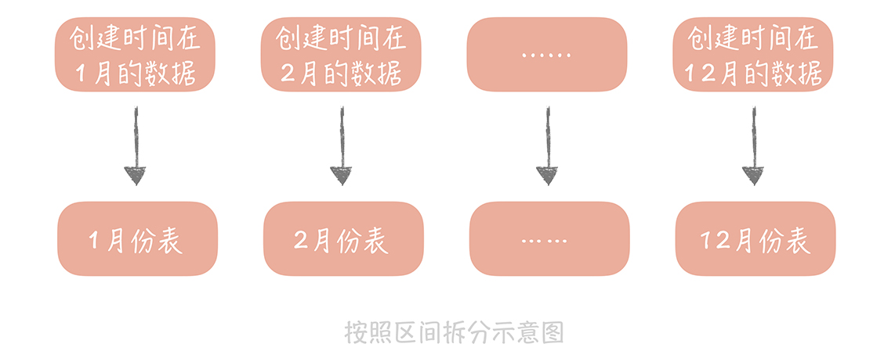

## 高并发系统

本文是阅读  [高并发系统设计 40 问](https://time.geekbang.org/column/intro/100035801) 后总结的内容

本文仅总结了大部分内容，仍有小部分内容尚未补充，更多详细内容请查看原文

[toc]

### 基础内容

#### 1.它的通用设计方法是什么？

1. 应对高并发，三种方法
   - **Scale-out（横向扩展）**：分而治之是一种常见的高并发系统设计方法，采用分布式部署的方式把流量分流开，让每个服务器都承担一部分并发和流量。
   - **缓存**：使用缓存来提高系统的性能，就好比用“拓宽河道”的方式抵抗高并发大流量的冲击。
   - **异步**：在某些场景下，未处理完成之前，我们可以让请求先返回，在数据准备好之后再通知请求方，这样可以在单位时间内处理更多的请求。
2. 一般系统的演进过程应该遵循下面的思路：
   - 最简单的系统设计满足业务需求和流量现状，选择最熟悉的技术体系。
   - 随着流量的增加和业务的变化，修正架构中存在问题的点，如单点问题，横向扩展问题，性能无法满足需求的组件。在这个过程中，选择社区成熟的、团队熟悉的组件帮助我们解决问题，在社区没有合适解决方案的前提下才会自己造轮子。
   - 当对架构的小修小补无法满足需求时，考虑重构、重写等大的调整方式以解决现有的问题。

---

#### 2.架构分层：为什么一定要这么做

1. 分层架构：将整体系统拆分成 N 个层次，每个层次有独立的职责，多个层次协同提供完整的功能

2. 分层好处：

   * **分层的设计可以简化系统设计，让不同的人专注做某一层次的事情**
   * **再有，分层之后可以做到很高的复用**
   * **最后一点，分层架构可以让我们更容易做横向扩展**

3. 阿里巴巴架构分层：

   

   - 终端显示层：各端模板渲染并执行显示的层。当前主要是 Velocity 渲染，JS 渲染， JSP 渲染，移动端展示等。
   - 开放接口层：将 Service 层方法封装成开放接口，同时进行网关安全控制和流量控制等。
   - Web 层：主要是对访问控制进行转发，各类基本参数校验，或者不复用的业务简单处理等。
   - Service 层：业务逻辑层。
   - Manager 层：通用业务处理层。这一层主要有两个作用，其一，你可以将原先 Service 层的一些通用能力下沉到这一层，比如与缓存和存储交互策略，中间件的接入；其二，你也可以在这一层封装对第三方接口的调用，比如调用支付服务，调用审核服务等。
   - DAO 层：数据访问层，与底层 MySQL、Oracle、Hbase 等进行数据交互。
   - 外部接口或第三方平台：包括其它部门 RPC 开放接口，基础平台，其它公司的 HTTP 接口。

---

#### 3.系统设计目标（一）：如何提升系统性能

1. 高并发系统设计的三大目标：高性能、高可用、可扩展

2. 性能优化原则

   * **首先，性能优化一定不能盲目，一定是问题导向的。**脱离了问题，盲目地提早优化会增加系统的复杂度，浪费开发人员的时间，也因为某些优化可能会对业务上有些折中的考虑，所以也会损伤业务。
   * **其次，性能优化也遵循“八二原则”，**即你可以用 20% 的精力解决 80% 的性能问题。所以我们在优化过程中一定要抓住主要矛盾，优先优化主要的性能瓶颈点。
   * **再次，性能优化也要有数据支撑。**在优化过程中，你要时刻了解你的优化让响应时间减少了多少，提升了多少的吞吐量。
   * **最后，性能优化的过程是持续的。**高并发的系统通常是业务逻辑相对复杂的系统，那么在这类系统中出现的性能问题通常也会有多方面的原因。因此，我们在做性能优化的时候要明确目标，比方说，支撑每秒 1 万次请求的吞吐量下响应时间在 10ms，那么我们就需要持续不断地寻找性能瓶颈，制定优化方案，直到达到目标为止。

3. 高并发下的性能优化

   * **提高系统的处理核心数**

     > 提高系统的处理核心数就是增加系统的并行处理能力，这个思路是优化性能最简单的途径。拿上一个例子来说，你可以把系统的处理核心数增加为两个，并且增加一个进程，让这两个进程跑在不同的核心上。这样从理论上，你系统的吞吐量可以增加一倍。当然了，在这种情况下，吞吐量和响应时间就不是倒数关系了，而是：吞吐量 = 并发进程数 / 响应时间。
     >
     > 
     >
     > 我们似乎找到了解决问题的银弹，是不是无限制地增加处理核心数就能无限制地提升性能，从而提升系统处理高并发的能力呢？很遗憾，随着并发进程数的增加，并行的任务对于系统资源的争抢也会愈发严重。在某一个临界点上继续增加并发进程数，反而会造成系统性能的下降，这就是性能测试中的拐点模型。
     >
     > 

   * **减少单次任务响应时间**

     >CPU 密集型系统中，需要处理大量的 CPU 运算，那么选用更高效的算法或者减少运算次数就是这类系统重要的优化手段。比方说，如果系统的主要任务是计算 Hash 值，那么这时选用更高性能的 Hash 算法就可以大大提升系统的性能。发现这类问题的主要方式，是通过一些 Profile 工具来找到消耗 CPU 时间最多的方法或者模块，比如 Linux 的 perf、eBPF 等。
     >
     >
     >
     >IO 密集型系统指的是系统的大部分操作是在等待 IO 完成，这里 IO 指的是磁盘 IO 和网络 IO。我们熟知的系统大部分都属于 IO 密集型，比如数据库系统、缓存系统、Web 系统。这类系统的性能瓶颈可能出在系统内部，也可能是依赖的其他系统，而发现这类性能瓶颈的手段主要有两类。
     >
     >第一类是采用工具，Linux 的工具集很丰富，完全可以满足你的优化需要，比如网络协议栈、网卡、磁盘、文件系统、内存，等等。
     >
     >另外一类手段就是可以通过监控来发现性能问题。在监控中我们可以对任务的每一个步骤做分时的统计，从而找到任务的哪一步消耗了更多的时间。

---

#### 4.系统设计目标（二）：系统怎样做到高可用？

1. 可用性的度量

   

2. 系统设计

   * **failover（故障转移）**

     > 完全对等的节点之间做 failover--- 直接切换
     >
     > 在不对等的节点之间，即系统中存在主节点也存在备节点 --- 可以使用心跳机制

   * **超时控制**

     > 建议通过收集系统之间的调用日志，统计比如说 99% 的响应时间是怎样的，然后依据这个时间来指定超时时间

   * **降级**

     > 保证核心服务的稳定而牺牲非核心服务

   * **限流**

     > 通过对并发的请求进行限速来保护系统

---

#### 5.系统设计目标（三）：如何让系统易于扩展？

1. 高可扩展性的设计思路

   * 拆分

     * 存储层扩展性

       > **存储拆分首先考虑的维度是业务维度**
       >
       > 第二次可按照数据特征做水平的拆分

     * 业务层扩展性

       > 从三个维度考虑业务层的拆分方案，它们分别是：业务纬度，重要性纬度和请求来源纬度
       >
       > 

---

### 数据库

#### 1.池化技术：如何减少频繁创建数据库连接的性能损耗？

1. 用连接池预先建立数据库连接---------最小连接数和最大连接数

   * 如果当前连接数小于最小连接数，则创建新的连接处理数据库请求；

   - 如果连接池中有空闲连接则复用空闲连接；
   - 如果空闲池中没有连接并且当前连接数小于最大连接数，则创建新的连接处理请求；
   - 如果当前连接数已经大于等于最大连接数，则按照配置中设定的时间（C3P0 的连接池配置是 checkoutTimeout）等待旧的连接可用；
   - 如果等待超过了这个设定时间则向用户抛出错误。

2. 用线程池预先创建线程 （coreThreadCount 和 maxTheadCount 是 java 中的概念）

   - 如果线程池中的线程数少于 coreThreadCount 时，处理新的任务时会创建新的线程；
   - 如果线程数大于 coreThreadCount 则把任务丢到一个队列里面，由当前空闲的线程执行；
   - 当队列中的任务堆积满了的时候，则继续创建线程，直到达到 maxThreadCount；
   - 当线程数达到 maxTheadCount 时还有新的任务提交，那么我们就不得不将它们丢弃了。
   - 
   - 使用线程池请一定记住不要使用无界队列（即没有设置固定大小的队列）。也许你会觉得使用了无界队列后，任务就永远不会被丢弃，只要任务对实时性要求不高，反正早晚有消费完的一天。但是，大量的任务堆积会占用大量的内存空间，一旦内存空间被占满就会频繁地触发 Full GC，造成服务不可用。

3. **池化技术核心是一种空间换时间优化方法的实践，所以要关注空间占用情况，避免出现空间过度使用出现内存泄露或者频繁垃圾回收等问题**

---

#### 2.数据库优化方案（一）：查询请求增加时，如何做主从分离？

1. 数据库交互过程

   

2. 主从复制

   * 主从复制过程

     * 首先从库在连接到主节点时会创建一个 IO 线程，用以请求主库更新的 binlog
     * 把接收到的 binlog 信息写入一个叫做 relay log 的日志文件中，而主库也会创建一个 log dump 线程来发送 binlog 给从库；
     * 从库还会创建一个 SQL 线程读取 relay log 中的内容，并且在从库中做回放，最终实现主从的一致性。
     * 

   * **不能无限制地增加从库的数量来抵抗大量的并发**

     > 随着从库数量增加，从库连接上来的 IO 线程比较多，主库也需要创建同样多的 log dump 线程来处理复制的请求，对于主库资源消耗比较高，同时受限于主库的网络带宽，所以在实际使用中，一般一个主库最多挂 3～5 个从库

3. 如何访问数据库

   * 嵌入应用程序中

     > 当有一个数据库请求时，中间件将 SQL 语句发给某一个指定的数据源来处理，然后将处理结果返回。

   * 单独部署的代理层

     > 这一类中间件部署在独立的服务器上，业务代码如同在使用单一数据库一样使用它，实际上它内部管理着很多的数据源，当有数据库请求时，它会对 SQL 语句做必要的改写，然后发往指定的数据源。
     >
     > 

---

#### 3.数据库优化方案（二）：写入数据量增加时，如何实现分库分表？

1. 垂直拆分

   * 一般是按照业务类型来拆分，核心思想是专库专用，将业务耦合度比较高的表拆分到单独的库中

2. 水平拆分

   * 将单一数据表按照某一种规则拆分到多个数据库和多个数据表中，关注点在数据的特点
* 拆分方式
  
  * 按照某一个字段的**哈希值**做拆分，这种拆分规则比较适用于实体表，比如说用户表，内容表，我们一般按照这些实体表的 ID 字段来拆分。
     * 
     * 按照某一个字段的区间来拆分，比较常用的是时间字段。一般来说，列表数据可以使用这种拆分方式，比如一个人一段时间的订单，一段时间发布的内容。
     * 
   * 分库分表引入的问题
  * 分区键，无论是哈希拆分还是区间段的拆分，我们首先都需要选取一个数据库字段，这带来一个问题是：我们之后所有的查询都需要带上这个字段，才能找到数据所在的库和表，否则就只能向所有的数据库和数据表发送查询命令。
     * **另外一个问题是一些数据库的特性在实现时可能变得很困难**，比如说多表的 join 在单库时是可以通过一个 SQL 语句完成的，但是拆分到多个数据库之后就无法跨库执行 SQL 了，不过好在我们对于 join 的需求不高，即使有也一般是把两个表的数据取出后在业务代码里面做筛选，复杂是有一些，不过是可以实现的。再比如说在未分库分表之前查询数据总数时只需要在 SQL 中执行 count() 即可，现在数据被分散到多个库表中，我们可能要考虑其他的方案，比方说将计数的数据单独存储在一张表中或者记录在 Redis 里面。

---

#### 4.发号器：如何保证分库分表后ID的全局唯一性？

1. 雪花算法

   * 

   * 实现方式
     * **一种是嵌入到业务代码里，也就是分布在业务服务器中。**这种方案的好处是业务代码在使用的时候不需要跨网络调用，性能上会好一些，但是就需要更多的机器 ID 位数来支持更多的业务服务器。另外，由于业务服务器的数量很多，我们很难保证机器 ID 的唯一性，所以就需要引入 ZooKeeper 等分布式一致性组件来保证每次机器重启时都能获得唯一的机器 ID。
     * **另外一个部署方式是作为独立的服务部署，这也就是我们常说的发号器服务。**业务在使用发号器的时候就需要多一次的网络调用，但是内网的调用对于性能的损耗有限，却可以减少机器 ID 的位数，如果发号器以主备方式部署，同时运行的只有一个发号器，那么机器 ID 可以省略，这样可以留更多的位数给最后的自增信息位。即使需要机器 ID，因为发号器部署实例数有限，那么就可以把机器 ID 写在发号器的配置文件里，这样即可以保证机器 ID 唯一性，也无需引入第三方组件了。

---

#### 5.NoSQL：在高并发场景下，数据库和NoSQL如何做到互补？

1.  使用 NoSQL 提升写入性能  
2.  提升扩展性

TODO----

---

### 缓存

#### 1.缓存：数据库成为瓶颈后，动态数据的查询要如何加速？

1. 缓存

   * 常见缓存性能对比 
   
     
   
2. 缓存与缓冲区

   * **缓存** 

     > 缓存可以提高低速设备的访问速度，或者减少复杂耗时的计算带来的性能问题。理论上说，我们可以通过缓存解决所有关于“慢”的问题，比如从磁盘随机读取数据慢，从数据库查询数据慢，只是不同的场景消耗的存储成本不同。

   * **缓冲区**

     > **缓冲区是一块临时存储数据的区域，这些数据后面会被传输到其他设备上。**缓冲区更像消息队列，用以弥补高速设备和低速设备通信时的速度差。

3. 缓存分类

   * **静态缓存**

     > 如在Nginx 上部署静态缓存可以减少对于后台应用服务器的压力

   * **分布式缓存**

     > TODO

   * **热点本地缓存**

     > **遇到极端的热点数据查询的时候。**热点本地缓存主要部署在应用服务器的代码中，用于阻挡热点查询对于分布式缓存节点或者数据库的压力。

4. 缓存不足

   * **缓存比较适合于读多写少的业务场景，并且数据最好带有一定的热点属性。**因为缓存毕竟会受限于存储介质不可能缓存所有数据，那么当数据有热点属性的时候才能保证一定的缓存命中率。
   * **缓存会给整体系统带来复杂度，并且会有数据不一致的风险。**当更新数据库成功，更新缓存失败的场景下，缓存中就会存在脏数据。对于这种场景，我们可以考虑使用较短的过期时间或者手动清理的方式来解决。
   * **缓存通常使用内存作为存储介质，但是内存并不是无限的。**因此，我们在使用缓存的时候要做数据存储量级的评估，对于可预见的需要消耗极大存储成本的数据，要慎用缓存方案。同时，缓存一定要设置过期时间，这样可以保证缓存中的会是热点数据。

---

#### 2.缓存的使用姿势（一）：如何选择缓存的读写策略？

1. **Cache Aside（旁路缓存）策略**
  
   * 更新数据时不更新缓存，而是删除缓存中的数据，在读取数据时，发现缓存中没了数据之后，再从数据库中读取数据，更新到缓存中。
   * 这个策略数据以数据库中的数据为准，缓存中的数据是按需加载的。它可以分为读策略和写策略。
   * **读策略**
     * 从缓存中读取数据；
     * 如果缓存命中，则直接返回数据；
     * 如果缓存不命中，则从数据库中查询数据；
     * 查询到数据后，将数据写入到缓存中，并且返回给用户。
   * **写策略**
     * 更新数据库中的记录；
     * 删除缓存记录。
   * Cache Aside 存在的最大的问题是当写入比较频繁时，缓存中的数据会被频繁地清理，这样会对缓存的命中率有一些影响。**如果你的业务对缓存命中率有严格的要求，那么可以考虑两种解决方案：**
     * 一种做法是在更新数据时也更新缓存，只是在更新缓存前先加一个分布式锁，因为这样在同一时间只允许一个线程更新缓存，就不会产生并发问题了。当然这么做对于写入的性能会有一些影响；
     * 另一种做法同样也是在更新数据时更新缓存，只是给缓存加一个较短的过期时间，这样即使出现缓存不一致的情况，缓存的数据也会很快地过期，对业务的影响也是可以接受。
   
2. **Read/Write Through（读穿 / 写穿）策略**

   * Write Through 的策略

     > 先查询要写入的数据在缓存中是否已经存在，如果已经存在，则更新缓存中的数据，并且由缓存组件同步更新到数据库中，如果缓存中数据不存在，我们把这种情况叫做“Write Miss（写失效）”。

     > 一般来说，我们可以选择两种“Write Miss”方式：一个是“Write Allocate（按写分配）”，做法是写入缓存相应位置，再由缓存组件同步更新到数据库中；另一个是“No-write allocate（不按写分配）”，做法是不写入缓存中，而是直接更新到数据库中。

     > 在 Write Through 策略中，我们一般选择“No-write allocate”方式，原因是无论采用哪种“Write Miss”方式，我们都需要同步将数据更新到数据库中，而“No-write allocate”方式相比“Write Allocate”还减少了一次缓存的写入，能够提升写入的性能。

   * Read Through 策略

     > 先查询缓存中数据是否存在，如果存在则直接返回，如果不存在，则由缓存组件负责从数据库中同步加载数据。

   * 示意图

     

3. **Write Back（写回）策略**

   * **写策略**

     > 策略的核心思想是在写入数据时只写入缓存，并且把缓存块儿标记为“脏”的。而脏块儿只有被再次使用时才会将其中的数据写入到后端存储中。

     

   * **读策略**

     > 在读取缓存时如果发现缓存命中则直接返回缓存数据。如果缓存不命中则寻找一个可用的缓存块儿，如果这个缓存块儿是“脏”的，就把缓存块儿中之前的数据写入到后端存储中，并且从后端存储加载数据到缓存块儿，如果不是脏的，则由缓存组件将后端存储中的数据加载到缓存中，最后我们将缓存设置为不是脏的，返回数据就好了。

     
     
   * **Write Back（写回）策略**是计算机体系结构中的设计，比如我们在向磁盘中写数据时采用的就是这种策略。无论是操作系统层面的 Page Cache，还是日志的异步刷盘，亦或是消息队列中消息的异步写入磁盘，大多采用了这种策略。因为这个策略在性能上的优势毋庸置疑，它避免了直接写磁盘造成的随机写问题，毕竟写内存和写磁盘的随机 I/O 的延迟相差了几个数量级呢。

---

#### 3.缓存的使用姿势（二）：缓存如何做到高可用？

1. **缓存命中率**

   > 缓存命中率 = 命中缓存的请求数 / 总请求数
   
   > 核心缓存的命中率需要维持在 99% 甚至是 99.9%，哪怕下降 1%，系统都会遭受毁灭性的打击。
   
2. **分布式缓存的高可用方案**

   - **客户端方案**就是在客户端配置多个缓存的节点，通过缓存写入和读取算法策略来实现分布式，从而提高缓存的可用性。
   - **中间代理层方案**是在应用代码和缓存节点之间增加代理层，客户端所有的写入和读取的请求都通过代理层，而代理层中会内置高可用策略，帮助提升缓存系统的高可用。
   - **服务端方案**就是 Redis 2.4 版本后提出的 Redis Sentinel 方案。

3. **客户端方案**

   * 关注写和读

     - 写入数据时，需要把被写入缓存的数据分散到多个节点中，即进行数据分片；
     - 读数据时，可以利用多组的缓存来做容错，提升缓存系统的可用性。关于读数据，这里可以使用主从和多副本两种策略，两种策略是为了解决不同的问题而提出的。

   * 缓存数据如何分片

     * **Hash 分片算法**

       > Hash 分片的算法就是对缓存的 Key 做哈希计算，然后对总的缓存节点个数取余。

       > 算法最大的优点就是简单易理解，缺点是当增加或者减少缓存节点时，缓存总的节点个数变化造成计算出来的节点发生变化，从而造成缓存失效不可用。

       > 如果采用这种方法，最好建立在对于这组缓存命中率下降不敏感的情况

       

     * **一致性 Hash 算法**

       > 1. 缓存节点在圆环上分布不平均，会造成部分缓存节点的压力较大；当某个节点故障时，这个节点所要承担的所有访问都会被顺移到另一个节点上，会对后面这个节点造成压力。
       > 2. 一致性 Hash 算法的脏数据问题。**在使用一致性 Hash 算法时一定要设置缓存的过期时间**

4. **中间代理层方案**

   > 所有缓存的**读写请求**都是经过代理层完成的。代理层是无状态的，主要负责读写请求的路由功能，并且在其中内置了一些高可用的逻辑，不同的开源中间代理层方案中使用的高可用策略各有不同。
   >
   > 比如在 Twemproxy 中，Proxy 保证在某一个 Redis 节点挂掉之后会把它从集群中移除，后续的请求将由其他节点来完成；而 Codis 的实现略复杂，它提供了一个叫 Codis Ha 的工具来实现自动从节点提主节点，在 3.2 版本之后换做了 Redis Sentinel 方式，从而实现 Redis 节点的高可用。

   

5. **服务端方案**

   * redis-sentinel
   * 

---

#### 4.缓存的使用姿势（三）：缓存穿透了怎么办？

1. **缓存穿透**：指从缓存中没有查到数据，而不得不从后端系统（比如数据库）中查询的情况

2. **缓存穿透的解决方案**

   * **回种空值**

     > 当我们从数据库中查询到空值或者发生异常时，我们可以向缓存中回种一个空值。但是因为空值并不是准确的业务数据，并且会占用缓存的空间，所以我们会给这个空值加一个比较短的过期时间，让空值在短时间之内能够快速过期淘汰。

     > **在使用的时候应该评估一下缓存容量是否能够支撑。**如果需要大量的缓存节点来支持，那么就无法通过通过回种空值的方式来解决,可以考虑使用布隆过滤器。

   *  **布隆过滤器**

      * 缺陷：

        1. 它在判断元素是否在集合中时是有一定错误几率的，比如它会把不是集合中的元素判断为处在集合中；

           > 主要是Hash 算法的问题，存在哈希碰撞

        2. 不支持删除元素。

      * 

   *  dog-pile effect（狗桩效应）

      > 概念：当有一个极热点的缓存项，它一旦失效会有大量请求穿透到数据库，这会对数据库造成瞬时极大的压力

      1. 在代码中，控制在某一个热点缓存项失效之后启动一个后台线程，穿透到数据库，将数据加载到缓存中，在缓存未加载之前，所有访问这个缓存的请求都不再穿透而直接返回。
      2. 通过在 Memcached 或者 Redis 中设置分布式锁，只有获取到锁的请求才能够穿透到数据库。

---

#### 5.CDN：静态资源如何加速？

1. **如何让用户的请求到达 CDN 节点**

   * DNS 映射

     > 将用户的请求映射到 CDN 服务器上，是使用 CDN 时需要解决的一个核心的问题，而 CNAME 记录在 DNS 解析过程中可以充当一个中间代理层的角色，可以把将用户最初使用的域名代理到正确的 IP 地址上。

2. **如何找到离用户最近的 CDN 节点**

   * GSLB（Global Server Load Balance，全局负载均衡）
   
     > 一方面，它是一种负载均衡服务器
   
     > 另一方面，它还需要保证流量流经的服务器与流量源头在地缘上是比较接近的。
   
3. 图例

   

---

### 消息队列

#### 1.消息队列：秒杀时如何处理每秒上万次的下单请求？

1. 消息队列削峰填谷

   

2. 异步处理，不紧急的任务可延后处理

3. 解耦合

---

#### 2.消息投递：如何保证消息仅仅被消费一次？

1. 消息丢失
   * 消息从生产者写入到消息队列的过程。
   * 消息在消息队列中的存储场景。
   * 消息被消费者消费的过程。
   
2. **在消息生产的过程中丢失消息**
   * 消息的生产者一般是我们的业务服务器，消息队列是独立部署在单独的服务器上的。两者之间的网络虽然是内网，但是也会存在抖动的可能，而一旦发生抖动，消息就有可能因为网络的错误而丢失。
   * **建议采用的方案是消息重传：**也就是当发现发送超时后就将消息重新发一次，但是也不能无限制地重传消息。一般来说，如果不是消息队列发生故障，或者是到消息队列的网络断开了，重试 2～3 次就可以了。
   * 这种方案可能会造成消息的重复，从而导致在消费的时候会重复消费同样的消息，消息生产时由于消息队列处理慢或者网络的抖动，导致虽然最终写入消息队列成功，但在生产端却超时了，生产者重传这条消息就会形成重复的消息。
   
3. **在消息队列中丢失消息** 

   * 以 kafka 讲解

     > Kafka 集群中有一个 Leader 负责消息的写入和消费，可以有多个 Follower 负责数据的备份。Follower 中有一个特殊的集合叫做 ISR（in-sync replicas），当 Leader 故障时，新选举出来的 Leader 会从 ISR 中选择，默认 Leader 的数据会异步地复制给 Follower，这样在 Leader 发生掉电或者宕机时，Kafka 会从 Follower 中消费消息，减少消息丢失的可能。
     >
     > 
     >
     > 由于默认消息是异步地从 Leader 复制到 Follower 的，所以一旦 Leader 宕机，那些还没有来得及复制到 Follower 的消息还是会丢失。为了解决这个问题，Kafka 为生产者提供一个选项叫做“acks”，当这个选项被设置为“all”时，生产者发送的每一条消息除了发给 Leader 外还会发给所有的 ISR，并且必须得到 Leader 和所有 ISR 的确认后才被认为发送成功。这样，只有 Leader 和所有的 ISR 都挂了，消息才会丢失。

     > 如果需要确保消息一条都不能丢失，那么建议不要开启消息队列的同步刷盘，而是需要使用集群的方式来解决，可以配置当所有 ISR Follower 都接收到消息才返回成功。

     > 如果对消息的丢失有一定的容忍度，那么建议不部署集群，即使以集群方式部署，也建议配置只发送给一个 Follower 就可以返回成功了。

     

4. **在消费的过程中存在消息丢失的可能**

   * 一个消费者消费消息的进度是记录在消息队列集群中的，而消费的过程分为三步：接收消息、处理消息、更新消费进度。
   * 这里面接收消息和处理消息的过程都可能会发生异常或者失败，比如说，消息接收时网络发生抖动，导致消息并没有被正确的接收到；处理消息时可能发生一些业务的异常导致处理流程未执行完成，这时如果更新消费进度，那么这条失败的消息就永远不会被处理了，也可以认为是丢失了。
   * 一定要等到消息接收和处理完成后才能更新消费进度，但是这也会造成消息重复的问题，比方说某一条消息在处理之后，消费者恰好宕机了，那么因为没有更新消费进度，所以当这个消费者重启之后，还会重复地消费这条消息。

5. **如何保证消息只被消费一次**

   * 想要完全的避免消息重复的发生是很难做到的，因为网络的抖动、机器的宕机和处理的异常都是比较难以避免的，在工业上并没有成熟的方法，因此我们会把要求放宽，只要保证即使消费到了重复的消息，从消费的最终结果来看和只消费一次是等同的就好了，也就是保证在消息的生产和消费的过程是“幂等”的。

   * **在消息生产过程中，**在 Kafka0.11 版本和 Pulsar 中都支持“producer idempotency”的特性，这种特性保证消息虽然可能在生产端产生重复，但是最终在消息队列存储时只会存储一份。

     > 它的做法是给每一个生产者一个唯一的 ID，并且为生产的每一条消息赋予一个唯一 ID，消息队列的服务端会存储 < 生产者 ID，最后一条消息 ID> 的映射。当某一个生产者产生新的消息时，消息队列服务端会比对消息 ID 是否与存储的最后一条 ID 一致，如果一致，就认为是重复的消息，服务端会自动丢弃。

   * **消费端**

     * **在通用层面**，你可以在消息被生产的时候，使用发号器给它生成一个全局唯一的消息 ID，消息被处理之后，把这个 ID 存储在数据库中，在处理下一条消息之前，先从数据库里面查询这个全局 ID 是否被消费过，如果被消费过就放弃消费。
     * **在业务层面**，增加乐观锁。TODO

---

#### 3.消息队列：如何降低消息队列系统中消息的延迟？

1. **如何监控消息延迟**

   * 使用消息队列提供的工具，通过监控消息的堆积来完成；

     > 使用一些 mq 中间件自带的工具，如kafka 的**kafka-consumer-groups.sh**和 **JMX**等

   * 通过生成监控消息的方式来监控消息的延迟情况。

     > 先定义一种特殊的消息，然后启动一个监控程序，将这个消息定时地循环写入到消息队列中，消息的内容可以是生成消息的时间戳，并且也会作为队列的消费者消费数据。业务处理程序消费到这个消息时直接丢弃掉，而监控程序在消费到这个消息时，就可以和这个消息的生成时间做比较，如果时间差达到某一个阈值就可以向我们报警。

     

2. **减少消息延迟**

   * **消费端**

     * 优化消费代码提升性能；
     * 增加消费者的数量（这个方式比较简单）。

   * **消息队列本身**

     * 消息的存储，提升消息存储到实际介质时的性能

     * 零拷贝技术

       1. 数据从磁盘拷贝到内核缓冲区;

       2. 系统调用将内核缓存区的数据拷贝到用户缓冲区；

       3. 用户缓冲区的数据被写入到 Socket 缓冲区中；

       4. 操作系统再将 Socket 缓冲区的数据拷贝到网卡的缓冲区中。

       5. 常规拷贝：

          

       6. 操作系统提供了 Sendfile 函数，可以减少数据被拷贝的次数。使用了 Sendfile 之后，在内核缓冲区的数据不会被拷贝到用户缓冲区，而是直接被拷贝到 Socket 缓冲区，节省了一次拷贝的过程，提升了消息发送的性能。零拷贝:

          

